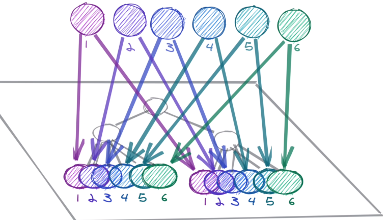

# When to use Jotai (Recoil)? When to use Apollo Client (Relay)?

## Atomic state management

Jotai and Recoil are two implementations of a new bread of state management paradigms called atomic state management. in this paradigm we save state in atoms that can be shared between components no matter how far they are in component tree. in other words it makes another tree in 3rd dimension to the React's DOM tree.

## Server side state management

Query libraries such as Apollo and Relay need to store and cache data in order to do their magic. this internal state that is coming from server is called server side state.

Server side state is intrinsically different from client side state in that it needs to sync itself to an outside source (server) while in client side states are either completely atomic or at most derived from other client side states

## When to use which?

Fetching, caching and mutating server's data should happen at server side state management libraries.

Any state that is only relevant to client should be stored in client side state management libraries such as jotai or recoil.
