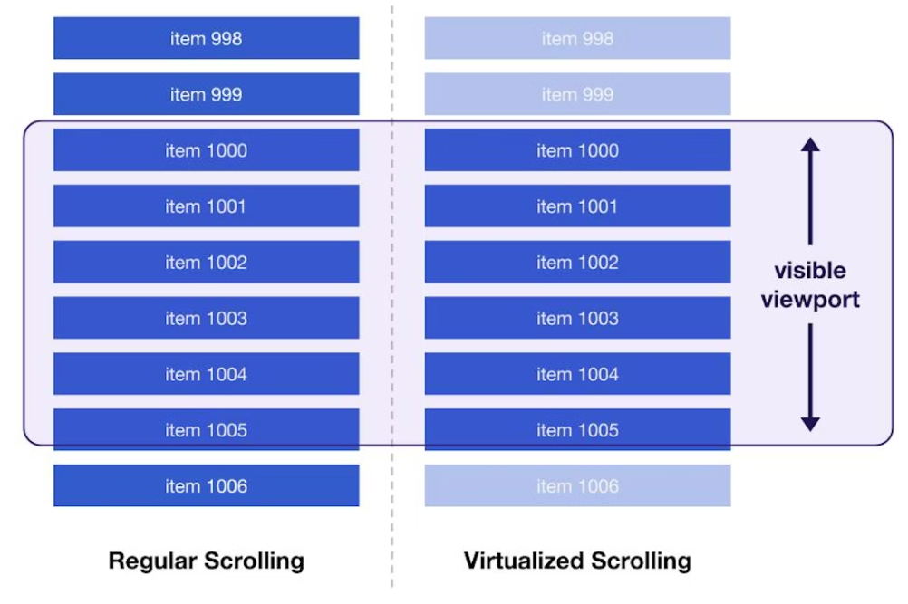

# Windowing in React

There are many cases in frontend development that you want to show a very large list. You can technically render all of your rows and put them in a div with `overflow: scroll;` but that would mean you are rendering all of your rows, even the ones that user don't see yet. needless to say, this approach can come with a significant performance hit.

## Windowing or list virtualization

From [web.dev](https://web.dev/virtualize-long-lists-react-window/#why-is-this-useful):

> List virtualization, or "windowing", is the concept of only rendering what is visible to the user. The number of elements that are rendered at first is a very small subset of the entire list and the "window" of visible content moves when the user continues to scroll. This improves both the rendering and scrolling performance of the list.

## Overscanning

Pre renders a subset of rows that are not in window yet. this can improve scrolling performance.
